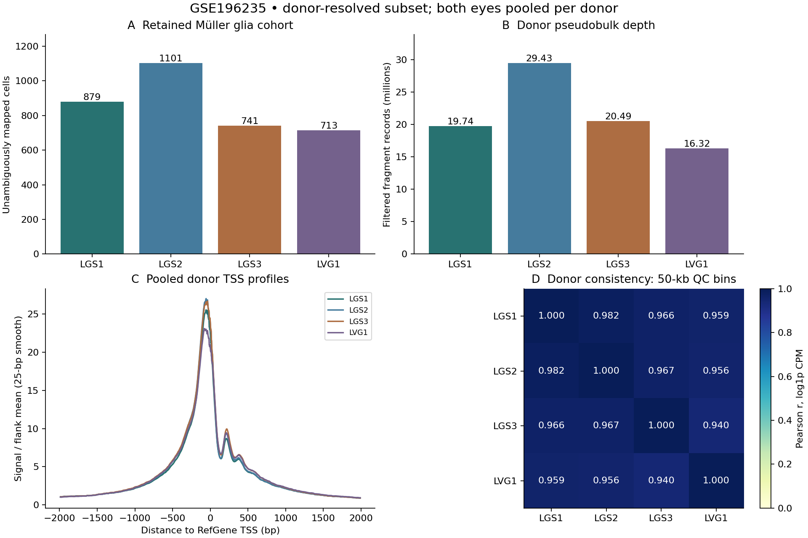
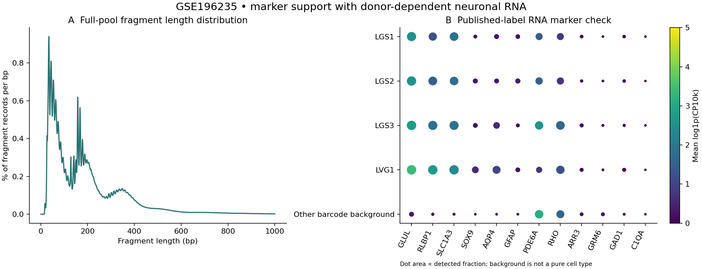

# Müller glia ChromBPNet feasibility — GSE196235

Assessed 2026-09-09. **GO for a training pilot using the donor-resolved subset. NO-GO for differential accessibility, design, or library preparation until the model is trained and validated.** Current model status: NOT TRAINED. This recommendation is a data-feasibility judgment, not proof of a reliable model.

## Measured depth and quality

The working cohort contains **3,434 published-label Müller glia cells**, **85,979,585 retained fragment records**, a median of **20,536.5 fragments/cell**, and cohort FRiP **62.2%**. Four donor pseudobulks are saved. Both eyes are combined within biological donor.

| Donor | MG cells* | Retained fragments* | Median/cell* | TSS proxy* | FRiP* |
|---|---:|---:|---:|---:|---:|
| LGS1 | 879 | 19,737,292 | 17,912 | 21.44 | 61.7% |
| LGS2 | 1,101 | 29,433,336 | 20,883 | 22.75 | 61.5% |
| LGS3 | 741 | 20,491,363 | 22,283 | 22.76 | 61.7% |
| LVG1 | 713 | 16,317,594 | 22,384 | 20.20 | 64.5% |

*All donor values describe the **unambiguously mapped subset**, not complete donor totals. Complete Müller glia cell counts and depths per donor remain unresolved for excluded barcodes; they are not zero. “Retained” means chr1–22,X, valid coordinates, no overlap with hg38 blacklist v2. Original alignment quality/deduplication is inherited from the processed release, not revalidated from BAMs.*

The complete published MG pool contains 92,966,728 records; 92,217,728 survive genomic filters. Read-support sum is 138,605,039; it is **not** independent fragment depth. There are 3,665 distinct bare barcodes, which cannot be equated to biological cells. Full-pool TSS proxy is 21.97; full-pool FRiP is 62.2%.

MACS3 called **104,194 diagnostic accessible peaks** after blacklist filtering (104,194 before). These are full-pool BEDPE peaks at q=0.01, not DA regions or the final relaxed ChromBPNet training peak set. FRiP counts each retained fragment once if it overlaps any diagnostic peak. The TSS proxy averages +/-50 bp relative to outer 100-bp flanks in +/-2 kb around 39,548 unique strand-specific RefGene TSSs; this differs from ArchR per-cell TSS scores.

## Annotation, donor consistency and quality caveats

Published labels are retained through membership in the authors' MG fragment file. Matching paired RNA supports them: GLUL is detected in 97.1% and RLBP1 in 86.7% of the working cohort. GLUL/RLBP1 mean normalized expression is higher than the other-barcode background. SLC1A3, SOX9, AQP4 and retinal off-target markers are included in the saved marker table. No cells were manually relabeled.

Bare barcodes lack sample prefixes: **231 barcodes and 6,288,321 records (6.76% of the full pool)** match multiple RNA samples. Excluding them preserves 3,434 identifiable cells and avoids guessing donors. The archived authors' RNA code supplies prefix-to-sample mapping; GEO/HCA supplies donor metadata. The four demographics are LVG1: 55/M; LGS1: 85/F; LGS2: 87/M; LGS3: 74/F with dementia recorded, although retinal tissue is marked normal. [GSE196235](https://www.ncbi.nlm.nih.gov/geo/query/acc.cgi?acc=GSE196235), [HCA project](https://explore.data.humancellatlas.org/projects/4f4f0193-ede8-4a82-8cb0-7a0a22f06e63), [archived annotation code](https://doi.org/10.5281/zenodo.6795162).

Donor ATAC correlations are 0.940–0.982 (Pearson, log1p CPM in blacklist-free 50-kb midpoint bins with nonzero pooled counts). TSS profiles agree and fragment lengths show nucleosomal structure. These coarse correlations do **not** establish base-resolution generalization or absence of batch effects. Donor, age and technical effects are confounded.

Neuronal RNA is a material caveat: PDE6A is detected in 55.5% overall, ranging from 36.7% in LVG1 to 75.6% in LGS3. Ambient RNA and residual mixed nuclei are possibilities, not established explanations. Require held-out-donor testing, rod/glial locus and motif inspection, and sensitivity to excluding LGS3 before calling the model reliable. Do not infer a new label from these markers alone.

## Available files and fallback

GSE196235 provides hg38 paired multiome data, 13 cell-type fragment pools and a 36,601-feature × 51,645-cell RNA matrix. The MG file is physically attached to GSM5866073, despite series prose pointing to rep1; it pools replicates. Downloaded MG fragments and all three RNA matrix components match HCA SHA256 checksums. No per-cell ATAC QC table or peak-by-cell matrix was present in the inspected GEO supplementary inventory. Therefore original per-cell TSS/FRiP distributions and full donor totals are unavailable from these inspected assets. Published filtering included TSS >6 and >2,500 ATAC fragments; that is a reported selection rule, not a newly measured per-cell result. [ATAC sample methods](https://www.ncbi.nlm.nih.gov/geo/query/acc.cgi?acc=GSM5866079).

The 2022 release includes **legacy BPNet** code/models and MG predictions, a useful precedent but not current ChromBPNet validation. [Study](https://doi.org/10.1016/j.xgen.2022.100164), [model code](https://doi.org/10.5281/zenodo.6796067).

Additional depth is not the current limiting factor. GSE265801 is a heterogeneous SuperSeries; do not pool it wholesale. Its GSE265774 archive listing contains 63 matrix files and no fragment-named files. Adult subseries GSE281526 has 31 fragment files totaling 57.07 GB; GSM8622730 explicitly supplies GRCh38/GENCODE32 multiome fragments, index and donor BCM_22_0047 metadata. Older GSM7064216 is hg19. The queried HRCA CELLxGENE collection contains RNA datasets, which cannot replace ATAC fragments. Atlas cell labels still need a validated barcode join before expansion. Avoid counting reanalyzed GSE196235 nuclei twice; exclude fetal cohorts from an adult pilot. [SuperSeries](https://www.ncbi.nlm.nih.gov/geo/query/acc.cgi?acc=GSE265801), [adult fallback sample](https://www.ncbi.nlm.nih.gov/geo/query/acc.cgi?acc=GSM8622730), [older hg19 sample](https://www.ncbi.nlm.nih.gov/geo/query/acc.cgi?acc=GSM7064216), [atlas resources](https://rchenlab.github.io/resources/human-atlas.html).

## Next gate and execution blocker

Proceed to a genome-wide ChromBPNet pilot with the donor-resolved cohort, matched genomic nonpeaks and the saved chromosome folds. First verify the reference/coordinate convention, generate insertion tracks, finalize relaxed training peaks/backgrounds, and fit a multiome-compatible bias model. Then assess multiple seeds, held-out counts/profiles, donor generalization and attribution/motif recovery. The current data do not show an obvious depth-based reason to reject a pilot. [Official preprocessing](https://github.com/kundajelab/chrombpnet/wiki/Preprocessing), [bias-model guidance](https://github.com/kundajelab/chrombpnet/wiki/Bias-model-training).

This workspace is macOS ARM64 with no detected NVIDIA tooling or ChromBPNet installation. No Linux/GPU execution target has been supplied. Training, bias fitting, validation losses, profile/count prediction metrics, attributions and checkpoints are therefore **not available**. No differential accessibility, candidate ranking, sequence optimization or brain-astrocyte analysis has run. See [workflow and validation criteria](../docs_workflow.md), [training parameters](../config/training_plan.json), and [validation gate](../config/model_validation.json).
