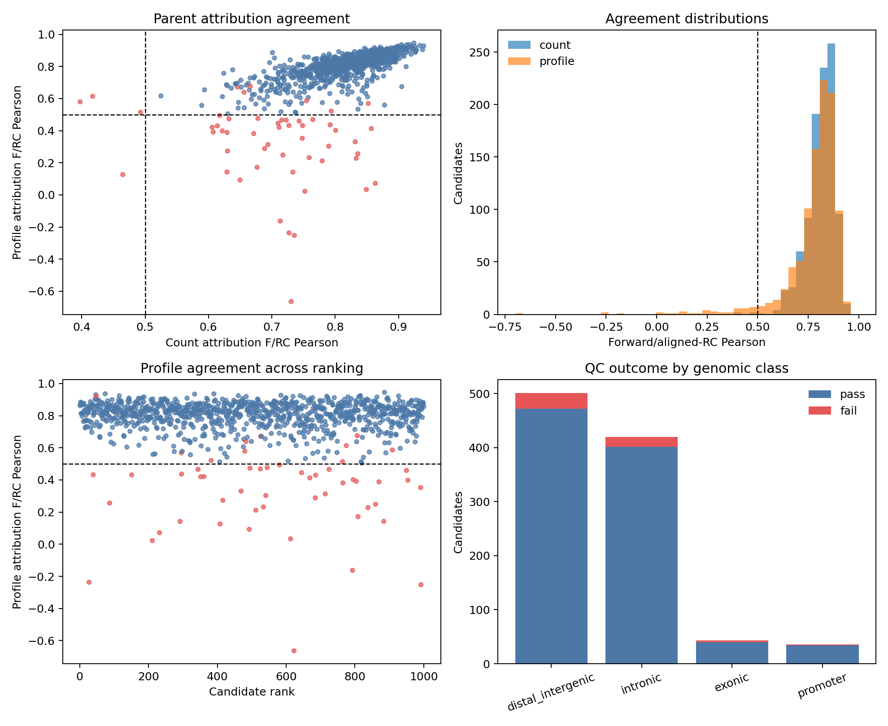

# Phase 4 Muller parent-attribution review

## Decision

**GO for attribution-guided perturbation on 947 of the 1,000 candidates.**
Great Lakes job `62995652` completed with exit code 0 from commit `bd181ee`
in 15 minutes 36 seconds on an A40, with peak RSS 14,649,208 KB. The
downloaded QC files match their recorded SHA256 values. The 53 candidates
that fail the orientation-agreement gate remain in the audit table and may
still be tested as natural parents, but they must not be used for model-guided
sequence editing in the current run.

The full attribution HDF5 remains in Great Lakes scratch at
`phase4_attribution/dual_orientation_attributions.h5`, with SHA256
`78d7a6e6c5b875b00de33449131cdd30bbd172e68b791408b4ac114fba4e1b95`.
Compact QC evidence is versioned under `reports/phase4/attribution/`.

## Orientation agreement

All count and profile agreement statistics are finite for all 1,000 parents.
Forward versus aligned reverse-complement count attribution has median Pearson
correlation 0.823. No count correlation is negative; four are below 0.5.
Count top-10%-magnitude sign concordance is at least 0.82 for every parent.

Profile attribution has median Pearson correlation 0.816. Its lower tail is
less stable: 43 parents have Pearson correlation below 0.5, four are negative,
and 33 have top-10%-magnitude sign concordance below 0.8. This instability is
not concentrated in one genomic class or rank interval. The Spearman
correlation between the earlier absolute count-prediction orientation delta
and profile-attribution Pearson is only -0.068, so the attribution gate adds
information beyond the parent count-orientation flag.

## Perturbation eligibility gate

A parent is eligible only when all of the following hold within its central
500-bp experimental sequence:

- count attribution forward/aligned-RC Pearson and cosine are each at least
  0.5;
- profile attribution forward/aligned-RC Pearson and cosine are each at least
  0.5;
- count and profile top-10%-magnitude sign concordance are each at least 0.8;
  and
- the 2,114-bp model input contains no ambiguous reference bases.

These are conservative project-level reproducibility thresholds, not universal
ChromBPNet performance standards. They yield 947 passing parents: 472 distal
intergenic, 401 intronic, 40 exonic, and 34 promoter-associated. The 53 failed
parents comprise 29 distal intergenic, 19 intronic, three exonic, and two
promoter-associated regions.

The single parent with ambiguous bases in its flanking model context is
excluded. Seven of the 947 passing parents retain a strand-mean predicted
log-count at or below 4 and should be treated as low-confidence model targets.
The extreme repeat-like parent `retina_peak_115786` fails the attribution gate
and is therefore excluded from editing.

## Perturbation contract

The next step is a limited perturbation pilot before scaling to every passing
parent. For each proposed edit, the pipeline must:

1. use the consensus hypothetical attribution only to nominate substitutions;
2. rescore the complete edited sequence with ChromBPNet in both orientations;
3. compare each orientation with the identically scored natural parent;
4. require the intended count effect in both orientations and reject strongly
   discordant effects;
5. retain profile-shape QC so a count increase does not arise from a grossly
   unstable profile; and
6. preserve the parent sequence and an explicit edit list in every output row.

The 226 passing parents whose natural count predictions differ by more than
one log-count unit between orientations remain eligible under this contract;
their strand-mean scores alone are insufficient for accepting an edit.

## Remaining limitations

- No off-target retinal sequence model is currently available. Sequence edits
  can be optimized for robust Muller prediction, while specificity continues
  to rely on the observed off-target accessibility evidence used in Phase 3.
- Attribution agreement measures reproducibility across orientations; it does
  not establish causal enhancer activity or guarantee an edit will work in an
  assay.
- Repeat overlap and mappability annotation are still required before final
  oligo selection.
- The 53 failed parents should not be silently replaced. They remain part of
  the original ranked 1,000 and must retain their failure reason in downstream
  tables.
