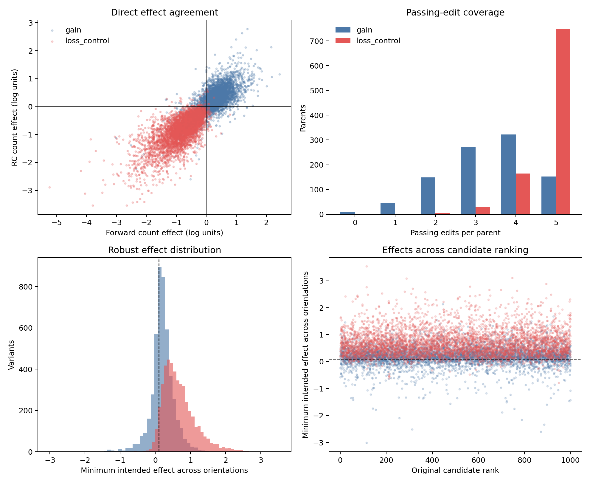

# Full Muller single-base perturbation review

## Decision

**PASS for provisional edit prioritization. Repeat and mappability annotation
remain required before library selection.** Great Lakes job `63110459`
completed from commit `90fe94d` with exit code 0 in 2 minutes 5 seconds,
with peak RSS 11,675,880 KB. All five source output checksums verify.

The scan includes all 947 attribution-passing parents and 9,470 single-base
variants, five gain nominations and five loss controls per parent. There were
no incomplete nominations. The other 53 natural parents retain their earlier
attribution-QC failure flags and are not included in this edit scan.



## Results

| Metric | Gain edits | Loss controls |
| --- | ---: | ---: |
| Nominated variants | 4,735 | 4,735 |
| Intended effect in both orientations | 3,847 (81.2%) | 4,649 (98.2%) |
| Passing effect and profile screen | 3,201 | 4,493 |
| Parents with at least one passing edit | 938/947 | 946/947 |
| Median strand-mean count effect, log units | +0.291 | -0.736 |
| Attribution nomination vs direct effect Spearman | 0.277 | 0.694 |
| Variants failing profile JSD screen | 0 | 5 |

The screen requires at least 0.1 intended log-count change in both
orientations and JSD at most 0.05 versus the parent in each orientation.
All 938 parents with a passing gain also have a passing loss control.
Gain nomination magnitude remains weakly calibrated, so ranking and
acceptance must continue to use direct model predictions.

`perturbation_full/best_passing_single_edits.tsv.gz` contains 1,884 rows:
one best passing gain for each of 938 parents and one best passing loss
control for each of 946 parents. Within each parent and class, selection
maximizes the minimum intended effect across orientations, with variant ID
as a deterministic tie breaker. This is a provisional model-based shortlist,
not a final experimentally validated library.

## Exceptions

Nine parents have no passing gain among the five tested nominations:

| Original rank | Peak ID | Genomic class |
| --- | --- | --- |
| 130 | retina_peak_109235 | intronic |
| 204 | retina_peak_076185 | intronic |
| 213 | retina_peak_109234 | intronic |
| 336 | retina_peak_039318 | intronic |
| 585 | retina_peak_029690 | promoter |
| 641 | retina_peak_058258 | distal intergenic |
| 736 | retina_peak_134919 | distal intergenic |
| 829 | retina_peak_077672 | distal intergenic |
| 864 | retina_peak_042291 | intronic |

Rank 213 also lacks a passing loss control. The other eight have passing
loss controls. Failure in this limited scan does not establish that no useful
single-base or multi-base edit exists. These nine parents have mean predicted
log-counts between 6.83 and 8.48; the missing gains are not confined to the
earlier low-prediction tail. Preserve the natural parents and failed edits
instead of silently replacing regions.

Five loss controls at ranks 404, 620 (two edits), 858, and 895 exceeded
profile JSD 0.05 in at least one orientation and are excluded by the screen.
They remain in the full result table for audit.

## Integrity and reproducibility

All 9,470 variant IDs are unique. Every edit is exactly one substitution in
the stored 500-bp parent, matches its recorded alleles and genomic position,
and verifies against parent/variant sequence hashes. Numeric results are
finite. Recomputed screen and per-parent coverage counts match the job outputs.
The job also checks mean parent predictions against the frozen baseline.

All 1,000 pilot variants recur in the full scan. Their forward and RC count
effects, strand-mean effects, and each orientation's profile JSD values match
the pilot exactly. The profile HDF5 contains 10,417 unique sequence IDs, with
finite, nonnegative, normalized 1,000-position profiles in both orientations.
The HDF5 remains in Great Lakes scratch; its SHA256 is
`a05369c5773142f73a5037d9f365c1033284a873deb7f4406919c245e9271822`.
Compact outputs, provenance, exceptions, shortlist, summary, and figure are
versioned under `reports/phase4/perturbation_full/`.

Reproduce the review with:

```bash
MPLCONFIGDIR=data/intermediate/matplotlib .venv/bin/python \
  scripts/review_phase4_perturbation_full.py \
  --results-dir reports/phase4/perturbation_full \
  --pilot reports/phase4/perturbation_pilot/perturbation_pilot.tsv.gz \
  --parents reports/phase4/parent_scoring/parent_predictions.tsv.gz \
  --config config/phase4_perturbation_full.json
```

## Next gate

Annotate repeat overlap and genomic mappability for all original parents,
retaining edited bases' repeat context. Then join differential-accessibility,
donor-reproducibility, motif, and model evidence into a reviewable library
table. Preserve natural parents alongside proposed variants.

These predictions use the same frozen model for nomination and verification.
Repeated scoring establishes computational reproducibility, not independent
model or experimental validation. Off-target variant accessibility is still
unavailable, and observed parent specificity cannot establish variant
specificity. Model gains do not establish enhancer activity or target genes.
Multi-base designs require direct rescoring of combined sequences.
