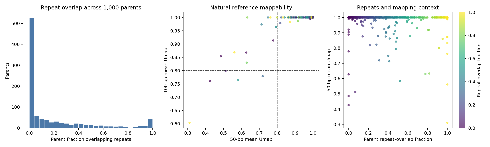

# Muller natural-locus annotation review

## Decision

**PASS annotation integrity; proceed to assembling the library review table.**
Great Lakes job `63115084` completed from commit `244984d` with exit code 0
in 2 minutes 4 seconds. Peak RSS was 7,268,924 KB. All six source output
checksums pass. All 1,000 original parent records and 1,884 proposed best
single-edit records are preserved exactly, with added annotations.

No automatic exclusions were applied. Repeat and mappability review flags
must remain visible when selecting library entries.



## Repeat context

508 of the 1,000 parents overlap at least one RepeatMasker record. The median
overlap fraction is 0.018, with 142 parents at least 50% repeat-overlapping
and 56 at least 90%. Repeat classes are retained separately; some parents
overlap multiple classes, so class counts must not be added as unique-parent
counts.

294 proposed substitutions lie within annotated repeats: 150 gain edits
and 144 loss controls. The annotated edit table preserves the repeat name,
class, and family at the edited base, alongside the full-parent overlap.
The review independently reconstructs a 500-base union mask from raw repeat
hits for each parent and confirms both parent overlap counts and edited-base
repeat membership.

Repeat overlap is common among this selected accessible-region set. It is
not sufficient by itself to reject a region or establish a mapping artifact.
The analysis has no matched genomic background for testing repeat enrichment.

## Reference-locus mappability

| Metric | 50-bp Umap | 100-bp Umap |
| --- | ---: | ---: |
| Median full-parent mean | 1.0 | 1.0 |
| 5th percentile of full-parent mean | 0.9639 | 1.0 |
| Lowest full-parent mean | 0.3108 | 0.6040 |
| Parents with mean below 0.8 | 15 | 5 |
| Proposed edited bases with reference score below 0.8 | 14 | 3 |

The 0.8 value is a descriptive review threshold, not an assay-specific mapping
cutoff. Thirteen parents represented in the proposed edit shortlist have
50-bp parent means below 0.8. The full low-mappability parent list, with
sequence and model evidence, is saved in
`locus_annotation/parents_with_low_reference_mappability.tsv.gz`.

High repeat overlap frequently coexists with high reference mappability.
Conversely, four of the 15 low-50-bp-mappability parents have no RepeatMasker
overlap. These annotations therefore provide distinct information.

The previously discordant rank-884 parent `retina_peak_115786` overlaps AluSp
and AluSx over 91.6% of its insert. Its 50-bp mean Umap is 0.8 and its 100-bp
mean is 1.0. This confirms the earlier repeat-like sequence observation but
does not explain the poor model prediction or prove a mapping artifact.
It retains its earlier failed-attribution flag and has no proposed edit.

## Provenance and limits

The raw assets remain under ignored `data/raw/phase4_annotation/` on Great
Lakes. Source URLs, retrieval times, HTTP metadata, observed SHA256 values,
and original parent/edit/reference-index input hashes are preserved in
`locus_annotation/annotation_provenance.json`. These are source snapshots
verified by locally observed checksums, not upstream published checksums.
The UCSC snapshot's HTTP timestamps are October 2022 for RepeatMasker and
April 2017 for Umap; these tracks are not represented as newly generated
annotations. Method and coordinate conventions are documented in
`locus_annotation_protocol.md`.

Mappability scores describe the natural hg38 reference locus. They are not
recomputed for designed variants and do not reproduce the actual paired-end
ATAC alignment settings. Omitted Umap intervals contribute zero to the mean
over all 500 parent bases. All reported annotation proportions and scores
are finite and within their expected bounds.

## Next gate

Assemble one library review table joining natural parents, proposed gain and
loss variants, differential-accessibility statistics, donor reproducibility,
genomic class, model predictions, important motif evidence, and the new
annotation flags. Preserve parents without proposed edits. Keep variant
off-target specificity explicitly unavailable until off-target sequence
predictions or experiments supply that evidence.

The table should support review before oligo selection; promoter, intronic,
exonic, distal, and repeat-derived open regions retain their original scope.
Experimental enhancer activity and target-gene assignment remain untested.

Reproduce this review with:

```bash
MPLCONFIGDIR=data/intermediate/matplotlib .venv/bin/python \
  scripts/review_phase4_locus_annotations.py \
  --results-dir reports/phase4/locus_annotation \
  --original-parents reports/phase4/parent_scoring/parent_predictions.tsv.gz \
  --original-edits reports/phase4/perturbation_full/best_passing_single_edits.tsv.gz
```
