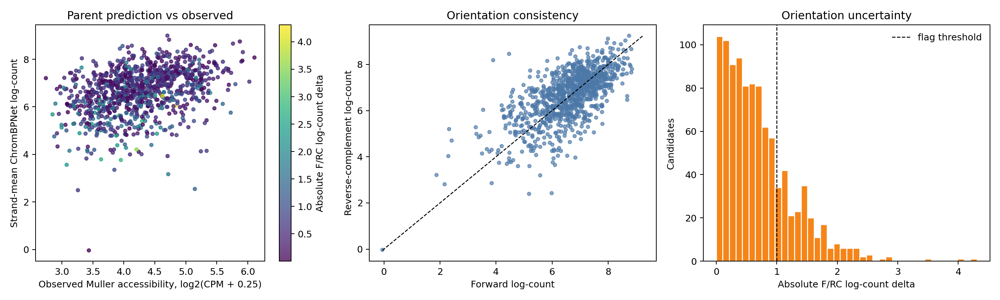

# Phase 4 Muller parent-sequence prediction review

## Decision

**GO for dual-orientation sequence attribution with a material count-head
orientation caveat.** Great Lakes job `62992460` completed with exit code 0
from commit `95ac72b` in 74 seconds on an A40. All four output checksums pass.
Variant generation remains blocked until dual-orientation attribution and
perturbation-consistency QC pass.

The complete profile HDF5 remains in scratch with SHA256
`1a019a7d08a0d67979c05db4ab24da631aa36cd1dd69fce1526313296db24aea`.
The parent table, compact summary, runtime record, checksums, and QC plot are
versioned under `reports/phase4/parent_scoring/`.

## Sequence integrity

All 1,000 parent sequences are unique, exactly 500 bp, and contain only A, C,
G, and T. The centered model inputs are exactly 2,114 bp. One input window,
candidate rank 48 (`retina_peak_157812`), contains three hard-masked bases in
the flanking context; its 500-bp parent itself is unambiguous. Keep this region
but flag it in attribution and variant review.

The model produced finite 1,000-bp profiles and log-count predictions for every
candidate. Strand-averaged predicted log-count has a positive association with
observed Muller accessibility across this deliberately selected set: Pearson
0.366 and Spearman 0.388. This is weaker than the earlier held-out peak result,
as expected after restricting the range to 1,000 strongly differential
candidates, and is an association screen rather than an independent model test.

Eleven candidates have strand-mean predicted log-count at or below 4. One
candidate, rank 884 (`retina_peak_115786`), is an extreme discordant case with
mean log-count -0.039 despite observed Muller mean CPM 10.57. Its parent is
unambiguously sequenced but contains an obvious repeat-like structure. Do not
discard these regions solely from the model score; flag low-prediction and
repeat-overlapping parents for the final library review. A reproducible repeat
and mappability annotation is still required before oligo selection.

## Orientation sensitivity

After reverse-complement profiles are aligned to the genomic orientation,
profile shapes are reasonably consistent: median Jensen-Shannon divergence is
0.0155, the 95th percentile is 0.0309, and only eight regions exceed 0.05.

The count head is substantially less stable. Forward versus reverse-complement
log-count correlation is 0.657. The median absolute difference is 0.579, 239
regions exceed 1 log-count unit, and 33 exceed 2. The effect has no material
global direction: forward is higher for 47.1% of regions and the mean signed
forward-minus-reverse difference is -0.058. It is not driven by GC content or
the single input with hard-masked flanking bases. This is model orientation
sensitivity rather than evidence for biological strand specificity.

## Attribution contract

All subsequent model interpretation must:

1. compute count and profile attribution for both the forward sequence and its
   reverse complement;
2. reverse-complement the second attribution map back to genomic orientation;
3. retain forward, aligned-reverse, and consensus maps separately;
4. report per-candidate attribution agreement and retain the parent prediction
   orientation delta;
5. flag the 239 candidates with absolute parent log-count delta above 1; and
6. require designed-variant effects to have the intended direction in both
   orientations before ranking them for experiments.

The strand-mean prediction is suitable for prioritization because it is
invariant by construction and correlates better with observed Muller
accessibility than either orientation alone. A single-orientation score is not
acceptable for variant optimization in this model.

## Remaining caveats

- Candidate sequences include flanking context during model scoring; variants
  must alter only the retained 500-bp parent unless a different experimental
  insert length is explicitly selected.
- The model predicts Muller accessibility, while off-target specificity still
  comes from observed retinal pseudobulks rather than off-target sequence
  models.
- Parent predictions do not prove enhancer activity or determine target genes.
- Repeat content and genomic mappability are not yet included in the candidate
  table and may explain some observed/model-discordant regions.
- Sequence designs must preserve every natural parent and report forward,
  reverse-complement, and strand-mean changes relative to that parent.
