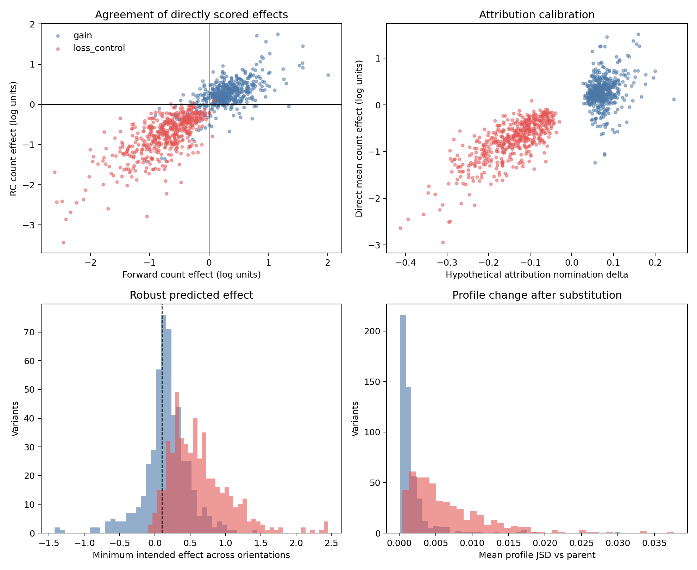

# Phase 4 single-base perturbation pilot review

## Decision

**GO for scaled single-base nomination and direct dual-orientation rescoring
across the 947 attribution-passing parents.** Job `63107642` completed with
exit code 0 in 57 seconds from commit `ad03597`, with peak RSS 10,893,324 KB.
The four original output checksums pass. The earlier failed job `63001997`
produced no variant predictions and is superseded by this successful run.

The pilot sampled the first 100 attribution-passing parents by Phase 3 rank
(ranks 1–104), with five nominated gain edits and five loss controls per parent.
It scored 1,100 sequences in each orientation. This selected high-ranking
sample does not establish the same success rate for all remaining parents.



## Direct model effects

| Metric | Gain edits | Loss controls |
| --- | ---: | ---: |
| Nominated substitutions | 500 | 500 |
| Intended count effect in both orientations | 395 (79.0%) | 494 (98.8%) |
| Median strand-mean log-count change | +0.253 | -0.700 |
| Median minimum intended effect across orientations | 0.163 | 0.552 |
| Nomination vs direct effect Spearman correlation | 0.197 | 0.729 |
| Forward vs RC direct effect Pearson correlation | 0.642 | 0.711 |
| Median profile JSD vs parent, averaged over orientations | 0.00104 | 0.00482 |

Attribution magnitude predicts gain size weakly. Some nominated gain edits
actually reduce the count prediction. Therefore hypothetical attribution
differences must remain nomination scores; acceptance and ranking must use
direct parent-versus-variant predictions in both orientations.

Every pilot parent has at least one gain edit and one loss control whose
intended effect is at least 0.1 log units in each orientation. There are 319
such gain edits and 475 such loss controls. At a stronger 0.2 threshold,
213 gain edits cover 92 parents; 441 loss controls cover 99 parents.
The 0.1 threshold is a project screening choice made during this review,
not a biological activity threshold or a prespecified statistical test.

No edit exceeds profile JSD 0.05 versus its parent in either orientation.
The observed maxima are 0.03885 forward and 0.04316 reverse complement.
This screens gross profile disruption but does not prove motif specificity.

## Integrity and provenance

All 1,000 variant IDs are unique. Each variant changes exactly one of the
500 parent bases, matches the recorded reference and alternate alleles,
and has the expected genomic position. Parent and variant sequence hashes
verify. Every numeric result is finite. Parent forward and RC predictions
match their original Phase 4 parent scores exactly.

The profile HDF5 contains 1,100 finite, nonnegative, normalized 1,000-position
profiles per orientation. Its original SHA256 is recorded in
`perturbation_pilot/output_checksums.sha256`. The local HDF5 copy is kept
under ignored intermediate data; the compact table, summary, runtime record,
checksums, review table, and figure are versioned. The source HDF5 remains in
Great Lakes scratch under `phase4_perturbation_pilot/`.

Reproduce the compact review with:

```bash
MPLCONFIGDIR=data/intermediate/matplotlib .venv/bin/python \
  scripts/review_phase4_perturbation_pilot.py \
  --results reports/phase4/perturbation_pilot/perturbation_pilot.tsv.gz \
  --output-dir reports/phase4/perturbation_pilot
```

## Next gate and limitations

Scale the same single-base nomination and scoring method to all 947 eligible
parents, retaining unsuccessful nominations and their direct effects for audit.
Require at least 0.1 intended log-count change in both orientations and profile
JSD at most 0.05 in each orientation for the first screened design table.
Further changes or combinations require direct rescoring of the complete
combined sequence because single-edit effects may interact.

No random matched substitutions were scored, so the pilot does not measure
enrichment over a random-edit baseline. All results are predictions from one
frozen model; experimental activity remains untested. A mutation that increases
Muller prediction can also increase activity in other retinal cells. Parent
observed specificity must not be presented as predicted variant specificity.
Off-target sequence models, repeat/mappability annotation, and experimental
validation remain outstanding for final library selection.
