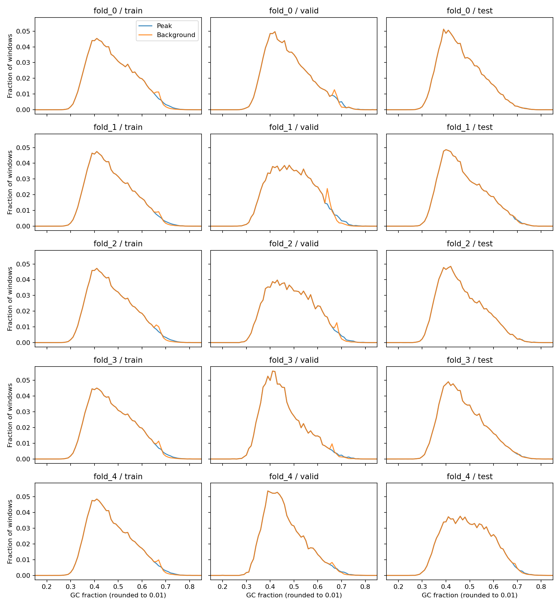
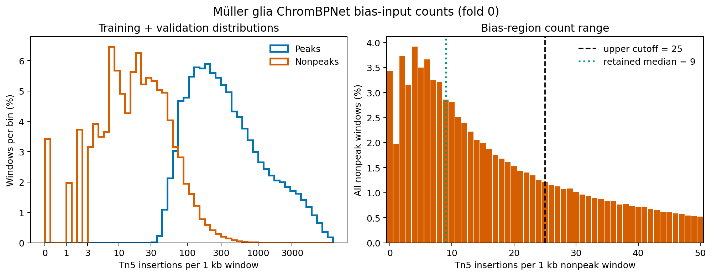

# Müller glia training-input preparation

Input-integrity validation: **PASS**. Model status: **NOT TRAINED**.
The GC review accepts these backgrounds for an exploratory pilot, with residual
mismatches recorded below. Proceed only if input-integrity validation also passes.
These results do not establish a reliable Müller glia model. Differential
accessibility and sequence design remain blocked.

- Four donor tracks; 85,979,585 retained fragment records and
  171,959,170 pooled insertions.
- hg38 analysis-set reference checksum verified; chr1–22 and X retained.
- Both independent shift checks for every donor recover native +4/−5 endpoints.
- 256,503 relaxed genome-wide peaks before filtering;
  256,248 training peaks after sequence/context filtering.
- 23,111,950 eligible background grid windows.
- Five folds with disjoint train/validation/test chromosomes; regions checked for ACGT,
  chromosome bounds, blacklist overlap and full 500-bp jitter context.
- Exact central input sequence/reverse-complement leakage is checked across
  splits. Near-homology and offset homology are not exhaustively evaluated.

## GC matching

GC gaps are absolute fractions (0.01 = one percentage point). Backgrounds are
selected without replacement within each split, using the nearest available
bucket when exact matching is exhausted. The figure shows every fold and split;
peak distributions are repeated to match the requested background ratio.

The initial 1,000-bp grid was rejected because of high-GC mismatch; its outputs
are archived. The final 100-bp grid gives at least
97.7% exact bucket matches per split.
At most 0.49% of pairs per split have a
gap greater than 0.05. Individual gaps still reach
0.17; GC-stratified held-out performance
must be inspected. Acceptance is a project judgment for a pilot, not a published
ChromBPNet threshold. Neighboring backgrounds can overlap within a split.

| Fold / split | Peaks | Negatives | Exact GC bucket | Mean GC gap | Maximum gap |
|---|---:|---:|---:|---:|---:|
| fold_0 / train | 184,040 | 368,080 | 98.9% | 0.0003 | 0.14 |
| fold_0 / valid | 17,901 | 35,802 | 99.0% | 0.0002 | 0.11 |
| fold_0 / test | 54,307 | 54,307 | 100.0% | 0.0000 | 0.02 |
| fold_1 / train | 180,572 | 361,144 | 99.2% | 0.0003 | 0.12 |
| fold_1 / valid | 24,407 | 48,814 | 97.7% | 0.0009 | 0.17 |
| fold_1 / test | 51,269 | 51,269 | 99.8% | 0.0000 | 0.03 |
| fold_2 / train | 191,060 | 382,120 | 99.0% | 0.0003 | 0.15 |
| fold_2 / valid | 18,107 | 36,214 | 98.8% | 0.0003 | 0.11 |
| fold_2 / test | 47,081 | 47,081 | 99.9% | 0.0000 | 0.02 |
| fold_3 / train | 184,401 | 368,802 | 99.0% | 0.0003 | 0.14 |
| fold_3 / valid | 17,416 | 34,832 | 99.2% | 0.0002 | 0.11 |
| fold_3 / test | 54,431 | 54,431 | 99.9% | 0.0000 | 0.05 |
| fold_4 / train | 187,672 | 375,344 | 99.2% | 0.0003 | 0.12 |
| fold_4 / valid | 19,416 | 38,832 | 99.3% | 0.0002 | 0.11 |
| fold_4 / test | 49,160 | 49,160 | 99.6% | 0.0001 | 0.07 |

## Fold 0 bias preparation

The fold 0, threshold 0.5 preparation job completed successfully. It retained
225,814 bias-training nonpeak regions after the count and outlier filters, from
403,882 train/validation nonpeaks. The estimated count-loss weight was 0.9;
ChromBPNet clamped it to 1.0 and emitted its low-read-depth warning. This is a
material caveat, but the retained-region count is sufficient to train one bias
candidate and assess its held-out behavior. The candidate must pass prediction
and motif-leakage QC before it can be used for the full accessibility model.
Machine-readable metrics and the decision are in
[`bias_prep_fold0.json`](bias_prep_fold0.json).

The count distribution confirms that this warning concerns the deliberately
low-signal nonpeak windows used to learn Tn5 bias. Across fold 0 train and
validation chromosomes, peak windows have median 298 insertions per 1 kb
(1st percentile 50), whereas all candidate nonpeaks have median 17. The bias
filter retains nonzero, non-outlier windows below the 25-count cutoff; their
median is 9. It does not justify removing a donor or discarding accessible
peaks. See [`bias_count_distribution_fold0.json`](bias_count_distribution_fold0.json)
for the complete quantiles and the script
[`plot_bias_count_distribution.py`](../../scripts/plot_bias_count_distribution.py)
for reproduction.

## Reproducibility and remaining work

See [the preparation guide](../../docs/training_preparation.md) for commands,
coordinate conventions, MACS3 and GC-sampling adaptations, and transfer steps.
Parameters, shift evidence, counts, validation and SHA256 manifests accompany
this report. Raw fragments and derived large files are retained outside Git.

QC exclusions and donor caveats remain those in the
[Phase 1 report](../phase1_qc_report.md). Input quality does not resolve potential
RNA contamination or donor imbalance. Training still requires a verified Linux
GPU runtime, bias fitting, multiple seeds, held-out profile/count evaluation,
donor generalization checks and attribution/motif review. No checkpoint exists.
