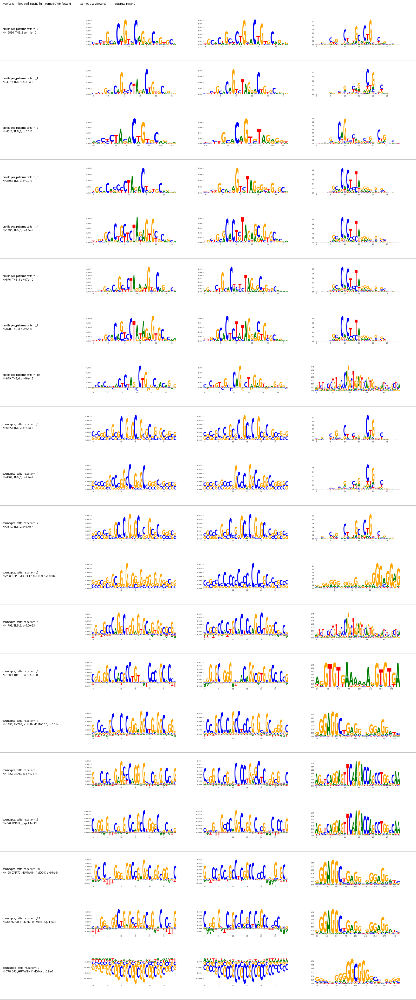

# Müller glia model-training QC

The fold 0, threshold 0.5, seed 42 Tn5 bias model is **accepted for the full
ChromBPNet pilot with a GC-composition caveat**. This is acceptance of the bias
component only. The Müller-glia ChromBPNet model is still not trained, and
differential accessibility remains blocked.

Held-out numerical QC on `chr1`, `chr3`, and `chr6` passed: nonpeak count
Pearson/Spearman correlations were 0.625/0.662, and peak count correlation was
positive (Pearson 0.359), avoiding the problematic anticorrelation failure mode.

TF-MoDISco used 30,000 deterministic held-out peak regions. All 15 profile
patterns had a Tn5 motif as their top database match; the first two contain
57.2% of profile seqlets and the first five contain 84.5%. The dominant learned
profile matrices visually match Tn5 patterns. Count attributions are more
composition-driven: 72.0% of positive count seqlets fall in patterns with an
enzyme-bias top match, while most remaining matrices are broad GC-rich,
AT-rich, or low-complexity effects.

The main caveat is a low-q SP2 match for one negative count pattern (778
seqlets, 1.97% of all count seqlets) and two small low-q ZN770 matches (165
seqlets together, 0.42%). Their learned matrices are diffuse composition
effects rather than compact versions of the matched TF logos. They do not block
the pilot, but the full no-bias model must be checked for residual Tn5 signal
and excessive GC-rich motifs. A systematic GC signal in its leading motifs
would trigger bias-threshold reconsideration.

See `bias_fold0_seed42_training.json`,
`bias_fold0_seed42_numerical_qc.json`, and
`bias_fold0_seed42_motif_qc.json` for machine-readable evidence.

