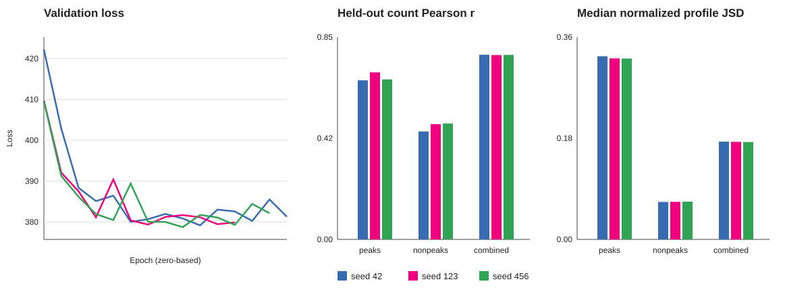

# Müller-glia ChromBPNet seed reproducibility

**Result: PASS with the existing nonpeak-calibration caveat.** Fold 0 models
with a 1.0 negative-sampling ratio were independently trained with seeds 42,
123, and 456. All three jobs converged, restored an early-stopping checkpoint,
completed held-out evaluation on chromosomes 1, 3, and 6, and produced finite
metrics. No traceback, fatal error, killed process, or out-of-memory event was
found in the Slurm logs.

| Metric | Seed 42 | Seed 123 | Seed 456 | Across-seed CV |
|---|---:|---:|---:|---:|
| Best validation loss | 379.175 | 379.371 | 378.745 | 0.084% |
| Peak count Pearson | 0.668 | 0.702 | 0.672 | 2.69% |
| Nonpeak count Pearson | 0.454 | 0.484 | 0.487 | 3.92% |
| Combined count Pearson | 0.776 | 0.774 | 0.775 | 0.092% |
| Peak median profile JSD | 0.470 | 0.472 | 0.472 | 0.274% |
| Combined median profile JSD | 0.623 | 0.624 | 0.624 | 0.067% |
| Nonpeak count MSE | 1.659 | 1.669 | 1.496 | 6.03% |

Validation loss varied by only 0.63 across replicas. Combined count correlation
varied by 0.0014 and combined profile JSD by 0.00077. Peak count correlation
remained positive and substantially above the matched scaled-bias result in all
three seeds. This is strong evidence that the model's aggregate held-out
performance is stable to random initialization and training order.

All three models retain the same calibration limitation: the full model has
lower nonpeak count correlation and higher nonpeak count MSE than the matched
scaled-bias baseline. The balanced training design substantially reduced the
broad nonpeak inflation seen with the 0.1 negative ratio, but it did not remove
the high-tail issue. This caveat should be retained in downstream scoring and
candidate filtering.

Seed reproducibility therefore passes. The remaining model-feasibility gate is
biological-donor sensitivity/generalization. Differential accessibility remains
blocked until that analysis is reviewed.

Machine-readable outputs are in
`chrombpnet_fold0_neg1_seed_reproducibility.json` and
`chrombpnet_fold0_neg1_seed_reproducibility.tsv`. Compact downloaded source
records are retained in `chrombpnet_seed_reproducibility_raw/`.
