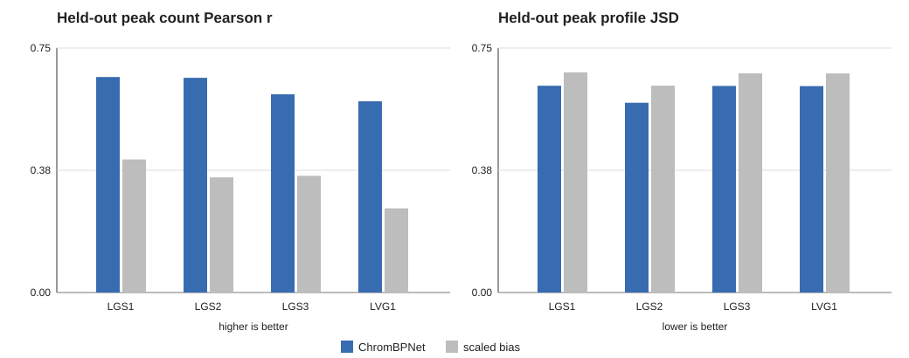

# Müller-glia ChromBPNet donor-sensitivity QC

**Result: PASS donor consistency with the established nonpeak-calibration
caveat.** The fold-0, seed-42, negative-ratio-1 model was evaluated against
donor-specific insertion tracks on held-out chromosomes 1, 3, and 6. All four
jobs and the summary job completed with exit code 0 and no fatal errors.

| Donor | Cells | Fragments | Peak Pearson | Peak Spearman | Peak JSD | Pearson gain over bias | JSD reduction vs bias |
|---|---:|---:|---:|---:|---:|---:|---:|
| LGS1 | 879 | 19,737,292 | 0.661 | 0.608 | 0.634 | +0.253 | +0.041 |
| LGS2 | 1,101 | 29,433,336 | 0.659 | 0.594 | 0.582 | +0.305 | +0.052 |
| LGS3 | 741 | 20,491,363 | 0.608 | 0.542 | 0.634 | +0.250 | +0.039 |
| LVG1 | 713 | 16,317,594 | 0.587 | 0.550 | 0.633 | +0.328 | +0.039 |

Peak count Pearson correlation is positive in every donor and varies from 0.587
to 0.661 (CV 5.9%). Combined peak/nonpeak Pearson correlation varies from 0.748
to 0.773 (CV 1.7%). The full model improves peak Pearson, peak Spearman, raw
profile JSD, and normalized-JSD goodness score over the matched scaled-bias
model in every donor. LGS3 is somewhat weaker for peak count ranking but is not
an isolated failure; LVG1 has the lowest peak Pearson, and all four donors show
the same qualitative model improvement.

The full model has lower nonpeak count correlation than the bias baseline in
every donor. This reproduces the known nonpeak-calibration caveat and indicates
that it is systematic rather than caused by one donor. Absolute count MSE is
not used for the donor decision because the checkpoint learned the pooled
library's count scale.

This analysis establishes consistency across the four contributing donors. It
does not constitute leave-one-donor-out generalization because all donors
contributed to the pooled training signal.

The validated biological checkpoint is
`models/chrombpnet/fold_0/seed_42_neg1/models/muller_chrombpnet_nobias.h5`
(SHA-256 `687befaa442fccae8896326acc884f9578cba5c5d2dd92412aa97f437384e80f`).
The combined prediction checkpoint SHA-256 is
`468a32f5f8e74a5ec4951b0377d633bd597d2584f89e7fe8971a46524c2de98f`.
